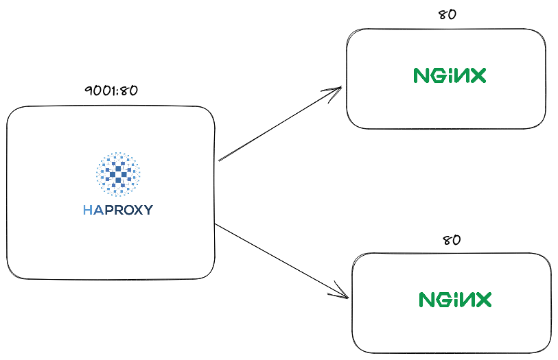

## About



Konfigurasi `default` di setingan ini menggunakan http / layer 7. kalau mau diubah jadi tcp / layer 4 ganti settingannya jadi seperti ini

```cfg
global
    maxconn 50000

defaults
    mode tcp
    timeout connect 5s
    timeout client 120s
    timeout server 120s

frontend mywebsite
    bind *:80
    default_backend webservers

backend webservers
    balance roundrobin
    server server1 server1:80 check
    server server2 server2:80 check

```

Referensi:

[https://www.serverlab.ca/tutorials/linux/network-services/layer-4-load-balancing-with-haproxy/](https://www.serverlab.ca/tutorials/linux/network-services/layer-4-load-balancing-with-haproxy/)

[https://www.serverlab.ca/tutorials/linux/network-services/layer-7-load-balancing-with-haproxy/](https://www.serverlab.ca/tutorials/linux/network-services/layer-7-load-balancing-with-haproxy/)
